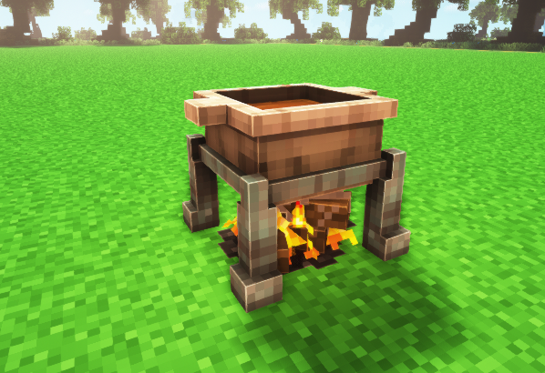
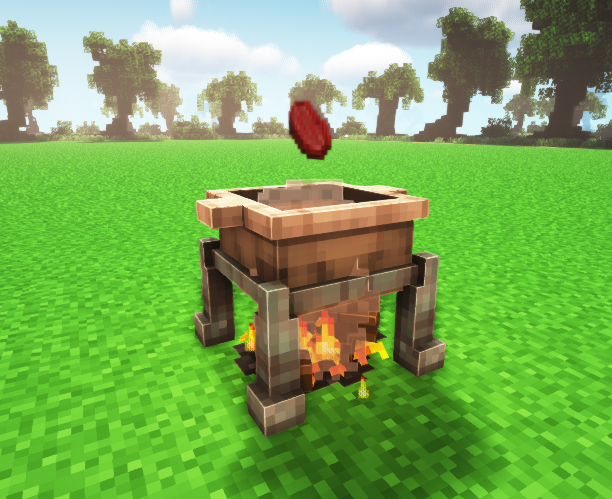
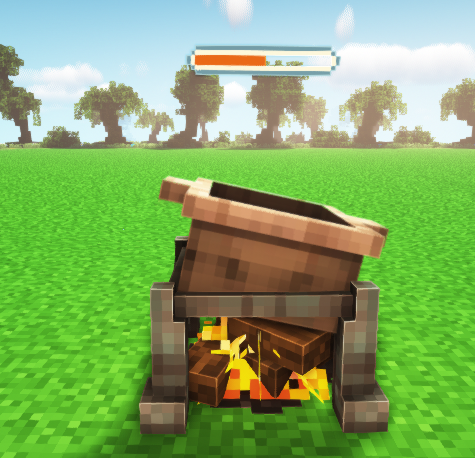
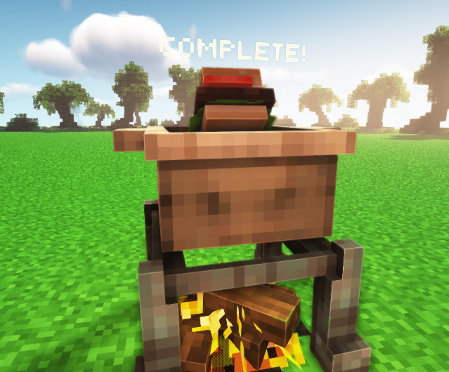
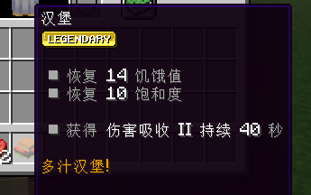

# 🥩 烹饪

点火，热锅

<figure><figcaption></figcaption></figure>

放入食材

<figure><figcaption></figcaption></figure>

等待读条

<figure><figcaption></figcaption></figure>

制作完成

<figure><figcaption></figcaption></figure>

<figure><figcaption></figcaption></figure>
